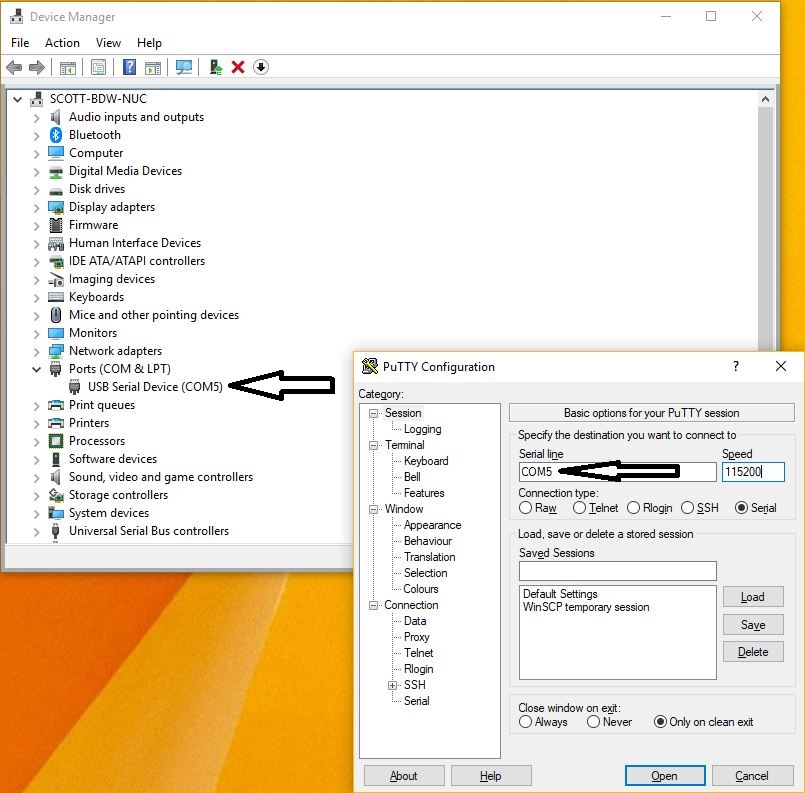

# Setting Up The Up Squared Board
The Up Squared Grove IoT Developer Kit includes the following components:

 - Up Squared Board + Power Supply
 - GrovePi Shield
 - Grove Sensors
	 - LCD Screen
	 - Rotary Angle Sensor
	 - Light Sensor
	 - Temperature & Humidity Sensor
	 - Button
	 - LED
 - Micro USB Cable
 - USB Stick


## Default Login
 - Username: **upsquared**
 - Password: **upsquared**

## Connections
There are 2 ways of communicating with the board out-of-the-box:

 1. Serial (via USB cable)
 2. HDMI Monitor + Keyboard

Follow these [instructions](https://software.intel.com/en-us/upsquared-grove-getting-started-guide-power-on-board) to connect the board. You can substitute the Serial USB connection for a HDMI monitor and USB keyboard if preferred.

### Serial Connection
To communicate via serial use your favourite serial console application such as **Screen** or **Putty** with a baud rate of **115200**. In Linux the serial device will show up as **/dev/ttyACM***. In **OS X** it will be something like **/dev/tty.usbmodem***.

> It is recommended to use SSH to communicate with the board if you are not using a monitor + keyboard. Serial is mainly useful to do initial setup and connect the board to your network.

Below is an example for connecting to the board on **Linux** or an **OS X** bash shell using **Screen**. 

Firstly determine what your serial device is mounted as:
``` bash
ls /dev/ttyACM* (Linux)
ls /dev/tty.usbmodem* (OS X)
```
Once you have determined which device is the Up Squared board use the following command to initialise serial communication:
``` bash
sudo screen {DEVICE_PATH} 115200
```
> **NOTE:** You may need to hit **Enter** a few times after a connection is established to start getting output in the console window.

In **Windows** you will need to check which **COM port** your serial device has been assigned. To do this open **Device Manager** and expand the **Ports (COM & LPT)** section. The Up Squared board will be listed as a **USB Serial Device (COM\*)**. Once you have determined which COM port is associated with the board use a tool such as **Putty** to initialise serial communication like in the screenshot below.



### WiFi
You can purchase the official Up Squared WiFi Kit [here](https://up-shop.org/up-peripherals/109-m2-2230-wifi-kit.html). The WiFi card is connected to the **M.2 2230** slot on the Up Squared board.

You may need to install the **linux-firmware** package before your WiFi adapter is successfully initialised using the command below:
``` bash
sudo apt install linux-firmware
```
Install the **wireless-tools** package to install some utilities to make connecting to a wireless access point from the command-line easier:
``` bash
sudo apt install wireless-tools
```
You can now use the **iwconfig** tool to connect to a wireless network. Start by making sure your wireless adapter is up and working by running the **iwconfig** command and ensuring your wireless adapter is listed:
``` bash
iwconfig
```
you should see output similar to this...
``` bash
enp2s0    no wireless extensions.

enp3s0    no wireless extensions.

lo        no wireless extensions.

wlp4s0    IEEE 802.11  ESSID:off/any
          Mode:Managed  Access Point: Not-Associated   Tx-Power=0 dBm
          Retry short limit:7   RTS thr:off   Fragment thr:off
          Power Management:on
```
The wireless adapter is named **wlp4s0** in this instance.

To connect to a wireless access point use the following commands:
``` bash
sudo iwconfig {ADAPTER_NAME} essid {SSID} key {PASSPHRASE}
sudo ip link set {ADAPTER_NAME} up
```
Use  **ifconfig** to make sure your wireless adapter has been assigned an IP address:
``` bash
ifconfig
```
you should see output similar to this...
``` bash
wlp4s0    Link encap:Ethernet  HWaddr 9c:b6:d0:d3:10:cd
          inet addr:192.168.1.233  Bcast:192.168.1.255  Mask:255.255.255.0
          inet6 addr: fe80::e122:ec06:fc44:4552/64 Scope:Link
          UP BROADCAST RUNNING MULTICAST  MTU:1500  Metric:1
          RX packets:11 errors:0 dropped:0 overruns:0 frame:0
          TX packets:48 errors:0 dropped:0 overruns:0 carrier:0
          collisions:0 txqueuelen:1000
          RX bytes:1414 (1.4 KB)  TX bytes:7516 (7.5 KB)
```
If you are having issues connecting make sure you entered the SSID and network key correctly or try rebooting to see if the wireless adapter comes up successfully:
``` bash
sudo reboot
```
### SSH
The board comes with SSH enabled out-of-the-box so once you have connected it to your network and determined it's IP address you can connect to it with your favourite SSH client.

Determine the IP address using the **ifconfig** utility:
``` bash
ifconfig
```
You will get output similar to this...
``` bash
enp3s0    Link encap:Ethernet  HWaddr 00:07:32:4a:a9:3e
          inet addr:192.168.1.27  Bcast:192.168.1.255  Mask:255.255.255.0
          inet6 addr: fe80::207:32ff:fe4a:a93e/64 Scope:Link
          UP BROADCAST RUNNING MULTICAST  MTU:1500  Metric:1
          RX packets:383 errors:0 dropped:0 overruns:0 frame:0
          TX packets:148 errors:0 dropped:0 overruns:0 carrier:0
          collisions:0 txqueuelen:1000
          RX bytes:53644 (53.6 KB)  TX bytes:20662 (20.6 KB)

lo        Link encap:Local Loopback
          inet addr:127.0.0.1  Mask:255.0.0.0
          inet6 addr: ::1/128 Scope:Host
          UP LOOPBACK RUNNING  MTU:65536  Metric:1
          RX packets:200 errors:0 dropped:0 overruns:0 frame:0
          TX packets:200 errors:0 dropped:0 overruns:0 carrier:0
          collisions:0 txqueuelen:1000
          RX bytes:14826 (14.8 KB)  TX bytes:14826 (14.8 KB)

wlp4s0    Link encap:Ethernet  HWaddr 9c:b6:d0:d3:10:cd
          inet addr:192.168.1.233  Bcast:192.168.1.255  Mask:255.255.255.0
          inet6 addr: fe80::e122:ec06:fc44:4552/64 Scope:Link
          UP BROADCAST RUNNING MULTICAST  MTU:1500  Metric:1
          RX packets:11 errors:0 dropped:0 overruns:0 frame:0
          TX packets:48 errors:0 dropped:0 overruns:0 carrier:0
          collisions:0 txqueuelen:1000
```
In this instance both **Ethernet** and **WiFi** are connected and have an IP address of **192.168.1.27** and **192.168.1.233** respectively.

Below is an example of connecting to the board over SSH from **Linux** or **OS X**:
``` bash
ssh upsquared@192.168.1.27
```
You will be prompted for the user password which is also **upsquared**.

## OS
The Up Squared board comes pre-installed with Ubuntu Server 16.04

### Graphical Desktop
If you require a graphical desktop you can install the default Ubuntu desktop with the following command:
``` bash
sudo apt install ubuntu-desktop
sudo reboot
```
The board will now reboot into the graphical desktop by default.

### Time Zone Configuration
The board may not be set to the correct time zone out-of-the-box.

You can check the current time zone configuration using the command below:
``` bash
timedatectl
```
You will get output like the following...
``` bash
Local time: Tue 2018-04-03 07:47:09 EDT
Universal time: Tue 2018-04-03 11:47:09 UTC
RTC time: Tue 2018-04-03 11:47:09
Time zone: America/New_York (EDT, -0400)
Network time on: yes
NTP synchronized: yes
RTC in local TZ: no
```
If the time zone is set incorrectly use the following commands to change it.

You can get a list of time zones by issuing the following command
``` bash
timedatectl list-timezones
```
The list is long but you can use **PgUp** and **PgDown** to navigate it. The format is generally **{Region}/{City}** so for example to update the time zone for the **UK** you can use the following command:
``` bash
sudo timedatectl set-timezone Europe/London
```
The output from **timedatectl** should now look like this:
``` bash
Local time: Tue 2018-04-03 13:00:46 BST
Universal time: Tue 2018-04-03 12:00:46 UTC
RTC time: Tue 2018-04-03 12:00:46
Time zone: Europe/London (BST, +0100)
Network time on: yes
NTP synchronized: yes
RTC in local TZ: no
```
> **Note:** The RTC time may still be incorrect. This requires changing in the BIOS but isn't required.

